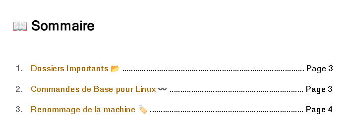
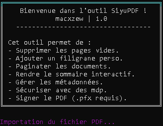

<h1 align="center">SiyuPDF </h1>

<p align="center">
    
    
</p>


> **SiyuPDF** is a Python CLI tool to clean, paginate, secure, and sign your PDFs.
>
> Originally created to fix common export bugs from [Siyuan](https://github.com/siyuan-note/siyuan): blank first page, shifted pagination, non-clickable table of contents…
>
> - Removes blank first page
> - Fixes pagination
> - Makes the table of contents clickable **if in standard format**:
>
> 
>
> <sup>The TOC should have section titles, dotted lines, and a page number at the end of each line.</sup>
>
> Also works with most standard PDFs.

---

<center>
<h2>👁️ Preview</h2>
</center>

<center></center>

---

## ⚙️ Features

- 🧹 Remove empty pages
- 💧 Add a custom watermark
- 🔢 Add pagination to documents
- 📝 Make table of contents clickable
- 🏷️ Edit and clean PDF metadata
- 🔐 Secure PDF with user & owner passwords
- ✒️ Digitally sign PDF files (.pfx support)
- 🖥️ Interactive CLI with colored output
- 📂 All temp files and results are managed in the `src/` directory

---

## 🚀 Installation

Clone this repo and install in development mode (recommended for testing/modification):

```bash
git clone https://github.com/Macxzew/siyupdf.git
cd siyupdf
pip install -e .
```

Or for a standard install:

```bash
pip install .
```

---

### 🔑 Generating a .pfx certificate (for digital signing)

Before signing a PDF, install **OpenSSL** and generate a TLS certificate (`.pfx`):

```sh
openssl genrsa -out private_key.key 2048
openssl req -new -key private_key.key -out certificate.csr
openssl x509 -req -days 365 -in certificate.csr -signkey private_key.key -out certificate.crt
openssl pkcs12 -export -out certificate.pfx -inkey private_key.key -in certificate.crt
```

You will then be able to select this `.pfx` certificate during the signing step.

---

## ▶️ Usage

After installation, use the command:

```bash
siyupdf
```

Or, to run locally without installing:

```bash
python -m siyupdf.main
```

---

## 📁 Project Structure

```
siyupdf/
├── siyupdf/
│   ├── config.py
│   ├── main.py
│   ├── message.py
│   ├── process.py
│   ├── utils.py
│   └── __init__.py
├── src/
│   └── arial.ttf
├── setup.py
└── requirements.txt
```

---

## 👤 Author

* Profile: [macxzew.github.io](https://macxzew.github.io)
* Discord: [Shynonime](https://discord.gg/YT7gU4FDkY)
* Github: [Macxzew](https://github.com/Macxzew)

---

## ⭐️ Show your support

Give a star if this project helped you!

***
